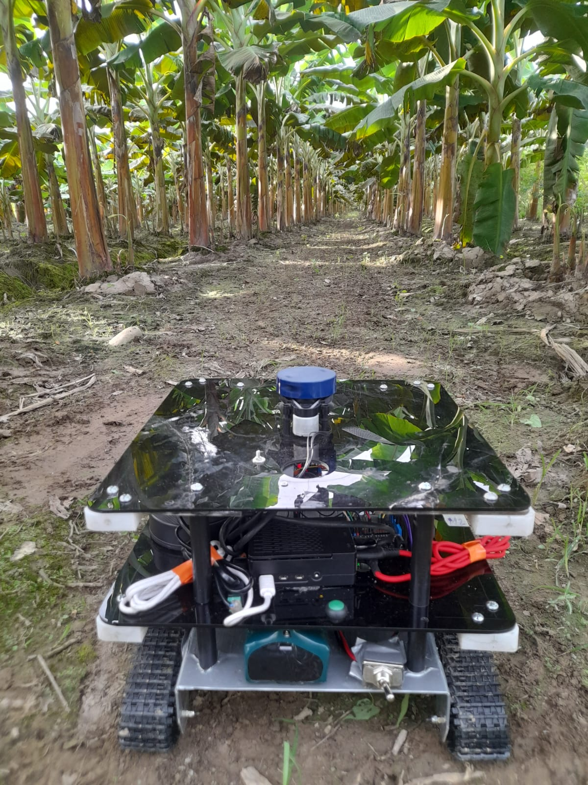
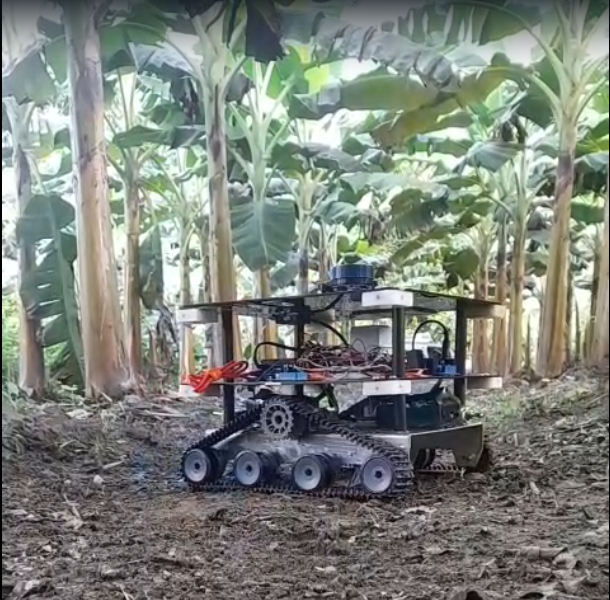

cat > README.md <<'EOF'
# Reactive Fuzzy Row-Following Robot for Plantain Crops

This repository contains all the **source code, data, and documentation** for a low-cost tracked robot designed to perform **reactive fuzzy logic-based row following** in plantain crop fields.  
It integrates **ROS 2 (Jazzy)** for high-level control and perception, and an **ESP32** microcontroller for low-level motor control.

---

## 📸 Field Pictures

<p align="center">
  
  
</p>

---

## 🧭 Overview

- **Main objective:** Develop and validate an affordable autonomous platform capable of navigating along plantain crop rows using LiDAR and fuzzy control.
- **Control structure:**  
  - High-level: ROS 2 node running fuzzy logic for lateral distance and orientation control.  
  - Low-level: ESP32 executing a PI controller with dead-zone compensation and PWM actuation.  
- **Sensors:**  
  - YDLidar X2 (2D LiDAR)  
  - BNO055 IMU (orientation)  
  - Quadrature encoders (wheel speed)

---

## 📂 Folder Structure (with explanations)

| Folder / File | Description |
|----------------|-------------|
| **\`CSV_ROBOT/\`** | Contains the **experimental data** collected during field and park tests. Each subfolder corresponds to a specific test (e.g., *PruebaCampo2-cono160-setpoint1metro-distanciacultivo1metro*), with `.csv` files storing time, distance errors, wheel speeds, LiDAR readings, and IMU data. |
| **\`scripts/\`** | Includes **Python utilities** for plotting and analyzing the CSV data. The main files are:<br>• `plotar.py`: plots the main variables with fixed limits (0–300 s).<br>• `graficar_en_config_recursive.py`: automatically searches subfolders and generates all plots recursively. |
| **\`docs/\`** | General documentation folder.<br>Inside it, the subfolder **`docs/img/`** stores images of the robot and field experiments used in the README or publications.<br>The main paper (`ERE.pdf`) is also stored here for reference. |
| **\`firmware/\`** | (Optional folder) Intended for the **ESP32 firmware** implementing the PI control, encoder reading, and PWM generation. |
| **\`ros2/\`** | (Optional folder) Contains **ROS 2 packages** for high-level control, such as:<br>• `lidar_left`: extracts lateral distance to the right wall.<br>• `wall_follower`: fuzzy controller computing wheel angular speeds.<br>• `serial_bridge`: communicates with the ESP32 for motor commands and telemetry. |
| **\`hardware/\`** | Hardware information and the **Bill of Materials (BOM)** for mechanical and electrical components. |
| **\`ERE.pdf\`** | Main technical document or paper describing the project, experiments, and results. |

---

## 🧠 How to Run the Plotting Scripts

1. Activate your Python environment and install dependencies:
   ```bash
   python3 -m venv .venv
   source .venv/bin/activate
   pip install -r requirements.txt
